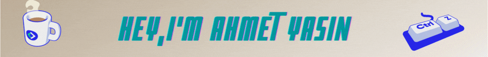

👋 Hello there! I'm Ahmet Yasin Burul , I'm Junior Web Developer
- 💻 I'm currently working on a Laravel Web Application
- ⏳ I am a Software Engineering student in Uskudar University
- 🚀 Always ready to collaborate for Dev Experiments
- 👨‍💻 I am also interested in 3D Object modelling,Animating and Game Development
- 🎯 Life Hack: "Explore 🔥 and Explode 💣 with knowledge"
- ⚡ Fun fact: I love to attend Meetups for learning & Conferences for Networking

🧠 Programming Languages & Databases

       

🕜 Libraries & Frameworks

     

🖌️ Gaming & Design

  

